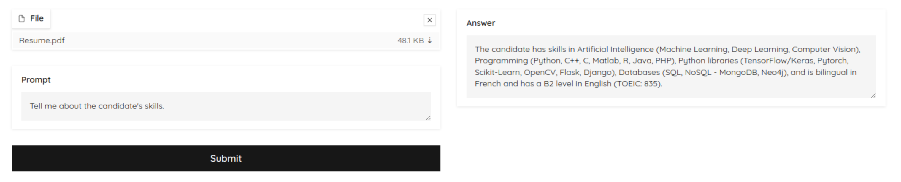

## LlamaIndex Very Basic Resume Explorer

This project utilizes `LlamaIndex`, `OpenAI` and `gradio` to explore a pdf document, specially a Resume. It's a very basic explorer, good to get start with LlamaIndex and Gradio.

  
  <h6 align="center">
    Gradio Interface
  </h6>  

## Requirements

- Python 3.10 or later
- Gradio
- LlamaIndex
- OpenAI
